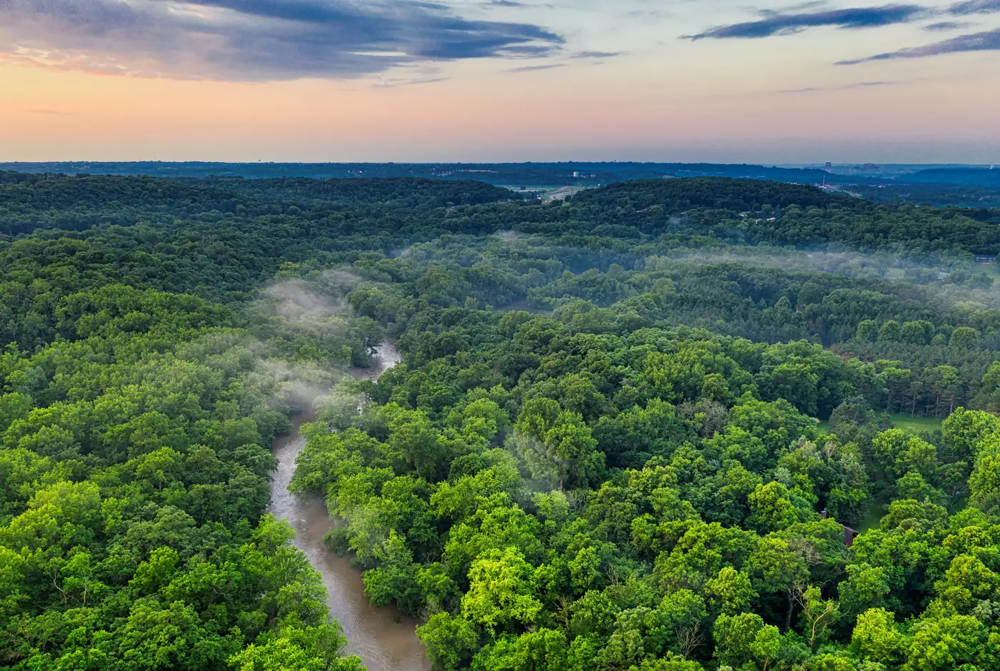
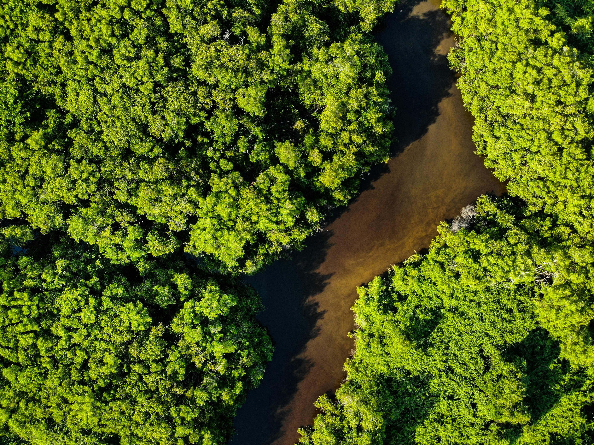
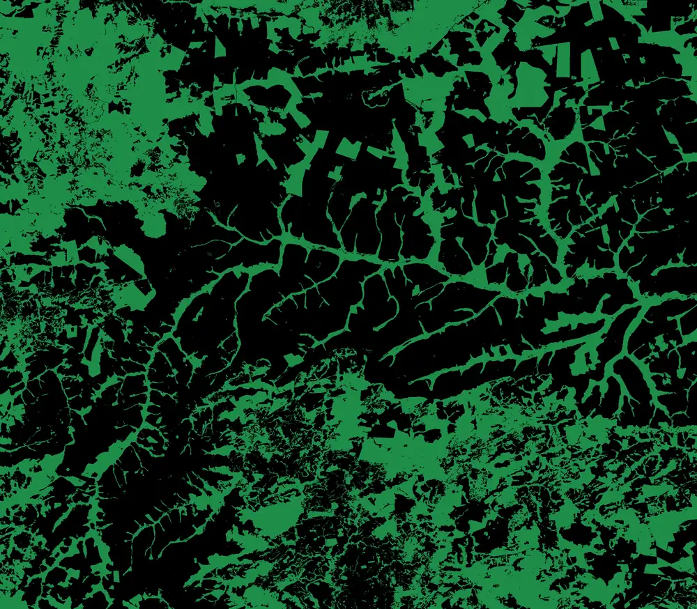

```{=html}
<div class="home-hero">
  <div class="hero-map" aria-hidden="true">
    
    
    
  </div>
  <div class="hero-lockup">
    
    <span class="hero-name">GAIA Lab</span>
  </div>
  <p class="hero-tagline">
    Machine learning and remote sensing for forests, agriculture and climate,
    at FGV EMAp, since 2024.
  </p>
  <a class="hero-cta" href="/research/">See the research</a>
  <a class="hero-scroll" href="#home-areas" aria-label="Scroll to the research areas">
    <svg viewBox="0 0 24 24" fill="none" stroke="currentColor" stroke-width="2.5" stroke-linecap="round">
      <path d="m5 9 7 7 7-7"/>
    </svg>
  </a>
</div>

<div class="home-body">
  <div id="home-areas" class="home-areas">
    <a class="area-card reveal" href="/research/#agriculture">
      <svg viewBox="0 0 24 24" fill="none" stroke-width="1.8" stroke-linecap="round">
        <path d="M4 20C4 11 11 4 20 4c0 9-7 16-16 16Z"/>
        <path d="M4 20C9 15 13 11 17 7"/>
      </svg>
      <div class="area-title">Agriculture</div>
      <div class="area-text">Crop classification and vegetation index series at plot scale.</div>
      <div class="area-kpi">359,600 plots<span>across 5 states, from 2020 to 2025</span></div>
    </a>
    <a class="area-card reveal" href="/research/#forests">
      <svg viewBox="0 0 24 24" fill="none" stroke-width="1.8" stroke-linecap="round" stroke-linejoin="round">
        <path d="M12 2 6 10h3l-4 7h14l-4-7h3L12 2Z"/>
        <path d="M12 17v5"/>
      </svg>
      <div class="area-title">Forests</div>
      <div class="area-text">Satellite forest segmentation, validated against official INPE data.</div>
      <div class="area-kpi">0.85 IoU<span>across 26 quarters, from 2020 to 2026</span></div>
    </a>
    <a class="area-card reveal" href="/research/#climate">
      <svg viewBox="0 0 24 24" fill="none" stroke-width="1.8" stroke-linecap="round" stroke-linejoin="round">
        <circle cx="8" cy="8" r="3.5"/>
        <path d="M8 1.5v2M8 12.5v2M1.5 8h2M12.5 8h2M3.4 3.4l1.4 1.4M11.2 11.2l1.4 1.4M12.6 3.4l-1.4 1.4"/>
        <path d="M13 17.5a4 4 0 0 1 7.6-1.2A3 3 0 0 1 20 22h-6a3 3 0 0 1-1-4.5Z"/>
      </svg>
      <div class="area-title">Climate</div>
      <div class="area-text">Climate trends and agricultural risk in 15-year windows.</div>
      <div class="area-kpi">+1.1 °C peak<span>Nova Mutum, MT, 2011 to 2025</span></div>
    </a>
</div>
```

## The lab in numbers

```{=html}
<div class="stats reveal">
  <div><div class="stat-num" data-count="359596" data-thousands=",">0</div><div class="stat-label">Plots mapped</div></div>
  <div><div class="stat-num" data-count="897">0</div><div class="stat-label">Municipalities</div></div>
  <div><div class="stat-num" data-count="5">0</div><div class="stat-label">States</div></div>
  <div><div class="stat-num">2020 to 2025</div><div class="stat-label">Data period</div></div>
</div>
```

## How we work

```{=html}
<div class="hscroll-wrap reveal">
  <button class="hscroll-btn prev" aria-label="Previous step"><svg viewBox="0 0 24 24" fill="none" stroke="currentColor" stroke-width="2.5" stroke-linecap="round"><path d="M15 5l-7 7 7 7"/></svg></button>
  <div class="hscroll">
    <article class="hs-card"><div class="hs-step">01</div><div class="hs-kicker">Step</div><div class="hs-title">Plot segmentation</div><div class="hs-text">Each production area is delimited from satellite imagery.</div></article>
    <article class="hs-card"><div class="hs-step">02</div><div class="hs-kicker">Step</div><div class="hs-title">Crop classification</div><div class="hs-text">Soybean, maize and cotton identified plot by plot, season by season.</div></article>
    <article class="hs-card"><div class="hs-step">03</div><div class="hs-kicker">Step</div><div class="hs-title">Satellite and climate series</div><div class="hs-text">17 vegetation indices and 10 climate series add up to 1,670 values per plot and season.</div></article>
    <article class="hs-card"><div class="hs-step">04</div><div class="hs-kicker">Step</div><div class="hs-title">Grouping by similarity</div><div class="hs-text">Plots gathered by spectral and climate behaviour.</div></article>
    <article class="hs-card"><div class="hs-step">05</div><div class="hs-kicker">Step</div><div class="hs-title">Risk characterisation</div><div class="hs-text">Each group is described by management, productivity and claim occurrence.</div></article>
  </div>
  <button class="hscroll-btn next" aria-label="Next step"><svg viewBox="0 0 24 24" fill="none" stroke="currentColor" stroke-width="2.5" stroke-linecap="round"><path d="m9 5 7 7-7 7"/></svg></button>
</div>
```

```{=html}
<p class="reveal" style="margin: 2.5rem 0 3rem;">
  <a class="pub-btn" href="/publications/">See the publications</a>
  <a class="pub-btn" href="/about/">About the lab</a>
  <a class="pub-btn" href="/join-us/">Contact us</a>
</p>
</div>
```
