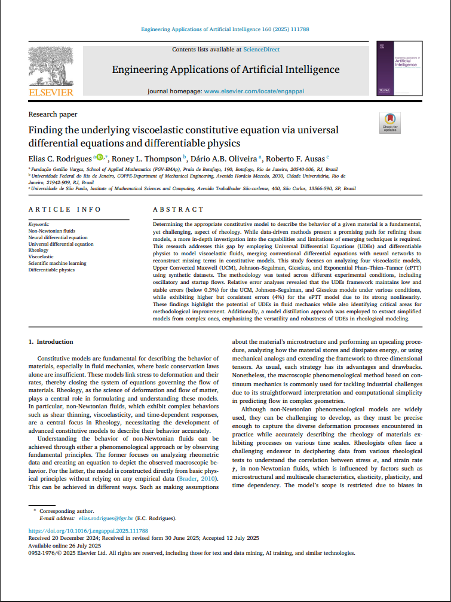

```{=html}
<div class="page-shell">
<div class="page-main">
```

:::: {.pub-detail}

::: {.pub-detail-thumb}
[](https://www.sciencedirect.com/science/article/pii/S0952197625017907)
:::

::: {.pub-detail-meta}
**Authors:** Elias C. Rodrigues, Roney L. Thompson, Dário A. B. Oliveira, Roberto F. Ausas

**Published:** November 2025, Engineering Applications of Artificial Intelligence, v. 160, 111788 (Pergamon)

[Read the article](https://www.sciencedirect.com/science/article/pii/S0952197625017907){.pub-btn}
:::

::::

## Abstract

Determining the appropriate constitutive model to describe the behavior of a given material is a fundamental, 
yet challenging, aspect of rheology. While data-driven methods present a promising path for refining these 
models, a more in-depth investigation into the capabilities and limitations of emerging techniques is required. 
This research addresses this gap by employing Universal Differential Equations (UDEs) and differentiable physics 
to model viscoelastic fluids, merging conventional differential equations with neural networks to reconstruct 
missing terms in constitutive models. This study focuses on analyzing four viscoelastic models, Upper Convected 
Maxwell (UCM), Johnson, Segalman, Giesekus, and Exponential Phan, Thien, Tanner (ePTT) using synthetic datasets. 
The methodology was tested across different experimental conditions, including oscillatory and startup flows. 
Relative error analyses revealed that the UDEs framework maintains low and stable errors (below 0.3%) for the 
UCM, Johnson, Segalman, and Giesekus models under various conditions, while exhibiting higher but consistent 
errors (4%) for the ePTT model due to its strong nonlinearity. These findings highlight the potential of UDEs 
in fluid mechanics while also identifying critical areas for methodological improvement. Additionally, a model 
distillation approach was employed to extract simplified models from complex ones, emphasizing the versatility 
and robustness of UDEs in rheological modeling.

:::: {.pub-figures}
![**Fig. 4.** Avaliação da extrapolação dos modelos UDE para a tensão de cisalhamento $(\sigma_{12}^*, t^*)$ com entrada $\dot{\gamma}^*(t^*) = 3\cos(1.5\,t^*)$. Os pontos destacados em verde correspondem aos pontos de treinamento, $t^* \in [0, 20]$. A curva azul ilustra a solução numérica da equação diferencial, chamada de solução de referência ("ground truth"). A curva preta representa o modelo UDE antes do treinamento, enquanto a curva vermelha ilustra o modelo UDE após o treinamento. Os seguintes parâmetros foram utilizados: $\xi = 0.4$ (Johnson, Segalman), $\alpha = 0.2$ (Giesekus) e $(\xi, \epsilon) = (0, 0.4)$ para (ePTT).](figura1.png)
::::

## How to cite

```bibtex
@article{rodrigues2025viscoelastic,
  title     = {Finding the underlying viscoelastic constitutive equation via
               universal differential equations and differentiable physics},
  author    = {Rodrigues, Elias C. and Thompson, Roney L. and
               Oliveira, Dário A. B. and Ausas, Roberto F.},
  journal   = {Engineering Applications of Artificial Intelligence},
  volume    = {160},
  pages     = {111788},
  year      = {2025},
  publisher = {Pergamon}
}
```

```{=html}
<a class="back-link" href="/publications/">
  <svg viewBox="0 0 24 24" fill="none" stroke="currentColor" stroke-width="2.2" stroke-linecap="round"><path d="M15 5l-7 7 7 7"/></svg>
  <span>Back to publications</span>
</a>
```

```{=html}
</div>
</div>
```
