```{=html}
<div class="page-shell">
<div class="page-main">
<p class="rsec-lead reveal">Três frentes de pesquisa, um mesmo método: transformar
imagem de satélite e série climática em informação que pode ser conferida contra
dado oficial. Cada frente tem um explorador, os números que a sustentam e o que
ainda não funciona.</p>

<section id="agricultura" class="rsec">
  <div class="rsec-head reveal">
    <div class="rsec-num">01</div>
    <div>
      <span class="rsec-kicker">Frente de pesquisa</span>
      <h2>Agricultura</h2>
    </div>
  </div>
  <p class="rsec-lead reveal">Classificação de culturas e séries de índices de
  vegetação em escala de talhão. A base própria cobre 359,6 mil talhões em 897
  municípios de cinco estados, com dados de 2020 a 2025.</p>

  <div class="rsec-block">
    <h3 class="rsec-sub reveal">Séries de índices de vegetação</h3>
    <p class="reveal">17 índices, 23 datas por ano e 499.720 séries por talhão,
    num total de 11,5 milhões de linhas. Troque a camada para ver o mesmo dado por
    outro ângulo.</p>

    <div class="explorer reveal" data-explorer data-captions="Sazonalidade média dos índices de vegetação nos cinco estados, por data de passagem do satélite.|Mapa de calor do NDVI, por município e data.|Distribuição bimodal do índice de cobertura de nuvem. O filtro CLEAROB igual ou maior que 0,5 remove 5,55 % das linhas cegas.">
      <div class="explorer-stage">
        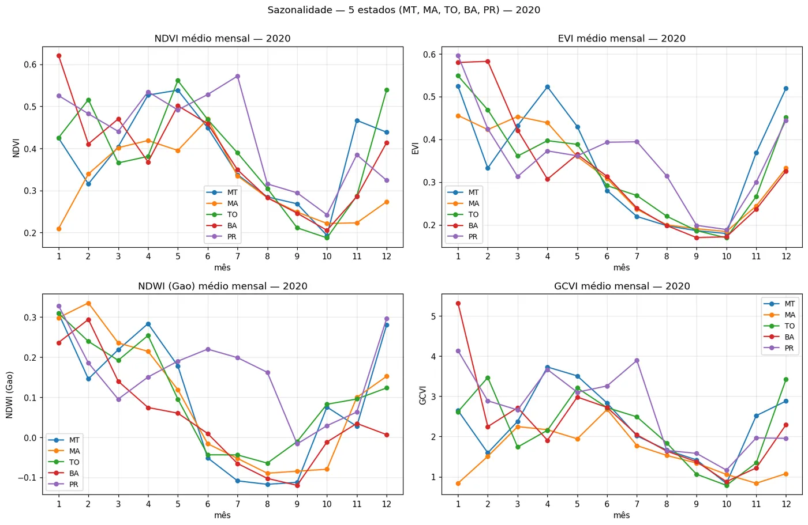
        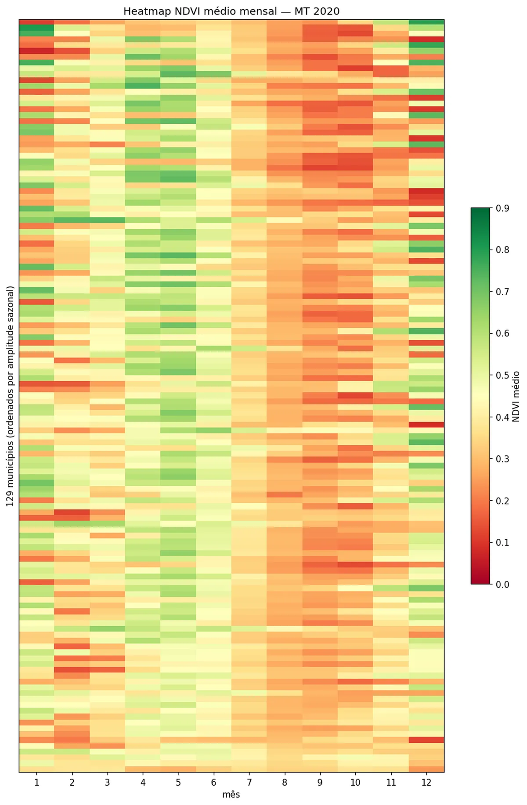
        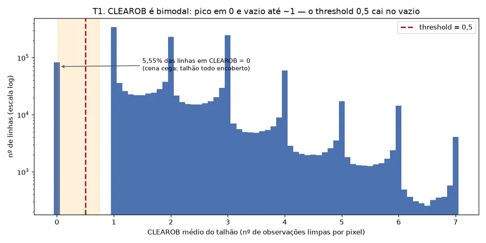
      </div>
      <div class="explorer-tabs" role="tablist" aria-label="Camadas das séries de índices">
        <button class="explorer-tab" type="button" role="tab" aria-selected="true">Sazonalidade por estado</button>
        <button class="explorer-tab" type="button" role="tab" aria-selected="false">Mapa de calor do NDVI</button>
        <button class="explorer-tab" type="button" role="tab" aria-selected="false">Filtro de nuvem</button>
      </div>
      <p class="explorer-caption">Sazonalidade média dos índices de vegetação nos cinco estados, por data de passagem do satélite.</p>
    </div>

    <div class="fig-grid reveal">
      <figure class="fig-card">
        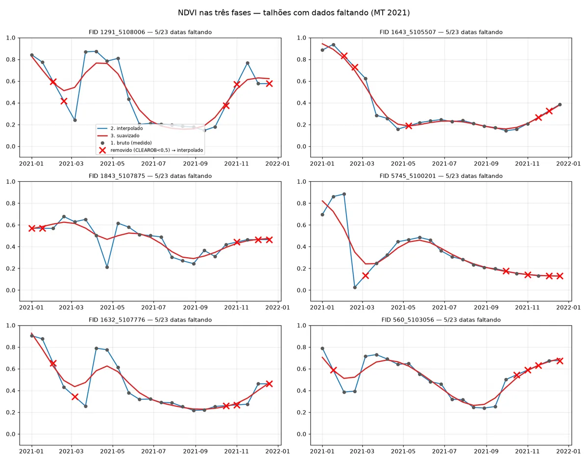
        <figcaption>Da série bruta à série pronta: observação original, interpolação e suavização.</figcaption>
      </figure>
      <figure class="fig-card">
        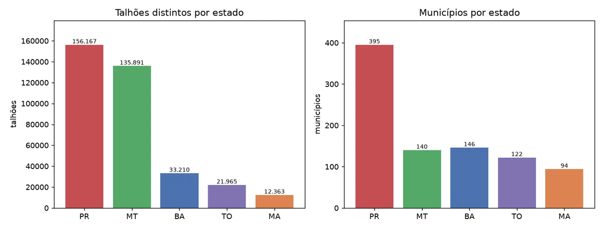
        <figcaption>Cobertura de observações válidas por talhão depois do filtro de nuvem.</figcaption>
      </figure>
    </div>
  </div>

  <div class="rsec-block">
    <h3 class="rsec-sub reveal">Início de safra contra a janela oficial</h3>
    <p class="reveal">Detectamos o início da safra pelo satélite e comparamos com a
    janela de plantio do ZARC, em Campo Verde, Mato Grosso. A janela oficial
    descreve bem a soja e quase não cobre o resto do calendário da fazenda.</p>

    <div class="janela reveal">
      <div class="janela-row">
        <div class="janela-name">Soja</div>
        <div class="janela-track"><div class="janela-fill" style="width: 65.5%"></div></div>
        <div class="janela-pct">65,5 %</div>
      </div>
      <div class="janela-row">
        <div class="janela-name">Algodão</div>
        <div class="janela-track"><div class="janela-fill" style="width: 7.6%"></div></div>
        <div class="janela-pct">7,6 %</div>
      </div>
      <div class="janela-row">
        <div class="janela-name">Milho safrinha</div>
        <div class="janela-track"><div class="janela-fill" style="width: 3.3%"></div></div>
        <div class="janela-pct">3,3 %</div>
      </div>
    </div>
    <p class="explorer-caption reveal">Parcela dos talhões cujo início de safra detectado cai dentro da janela oficial, em Campo Verde, Mato Grosso. A soja soma 2.971 de 4.539 talhões. Em outros municípios analisados, a soja fica entre 72,7 % e 84,5 %.</p>
  </div>

  <div class="metrics reveal">
    <div><div class="m-val">359.596</div><div class="m-lab">Talhões mapeados</div></div>
    <div><div class="m-val">897</div><div class="m-lab">Municípios</div></div>
    <div><div class="m-val">17</div><div class="m-lab">Índices de vegetação</div></div>
    <div><div class="m-val">11,5 mi</div><div class="m-lab">Linhas de séries</div></div>
  </div>

  <div class="hscroll-wrap reveal">
    <button class="hscroll-btn prev" aria-label="Projetos anteriores"><svg viewBox="0 0 24 24" fill="none" stroke="currentColor" stroke-width="2.5" stroke-linecap="round"><path d="M15 5l-7 7 7 7"/></svg></button>
    <div class="hscroll">
      <article class="hs-card"><div class="hs-kicker">Projeto 01</div><div class="hs-title">Classificação de culturas por talhão</div><div class="hs-text">Soja, milho e algodão identificados talhão por talhão e safra por safra. Contra os dados de campo do INPE em Campo Verde, a acurácia média foi 98,7 % na soja, 91,5 % no milho e 90,0 % no algodão. A referência pública marca 99,3 %, 82,4 % e 64,4 %.</div></article>
      <article class="hs-card"><div class="hs-kicker">Projeto 02</div><div class="hs-title">Base própria de talhões</div><div class="hs-text">Base gerada a cada safra, reprocessada a cada ciclo e extensível a novos estados: 359,6 mil talhões em 897 municípios de Bahia, Maranhão, Mato Grosso, Tocantins e Paraná.</div></article>
      <article class="hs-card"><div class="hs-kicker">Projeto 03</div><div class="hs-title">Séries temporais de índices</div><div class="hs-text">17 índices, 23 datas por ano e 499.720 séries, com filtro de nuvem e interpolação documentados, num total de 11,5 milhões de linhas.</div></article>
      <article class="hs-card"><div class="hs-kicker">Projeto 04</div><div class="hs-title">Agrupamento por comportamento</div><div class="hs-text">Cada talhão e safra reúne 1.670 valores entre índices, séries diárias e séries climáticas. O agrupamento por semelhança revela perfis de comportamento dentro da carteira.</div></article>
      <article class="hs-card"><div class="hs-kicker">Projeto 05</div><div class="hs-title">Produtividade e risco</div><div class="hs-text">Um dos grupos, com 1.240 talhões, aparece com produtividade 18 % abaixo da média, solos arenosos e 3,1 vezes mais ocorrência de sinistro. O grupo é classificado como risco alto.</div></article>
    </div>
    <button class="hscroll-btn next" aria-label="Próximos projetos"><svg viewBox="0 0 24 24" fill="none" stroke="currentColor" stroke-width="2.5" stroke-linecap="round"><path d="m9 5 7 7-7 7"/></svg></button>
  </div>
</section>

<section id="floresta" class="rsec">
  <div class="rsec-head reveal">
    <div class="rsec-num">02</div>
    <div>
      <span class="rsec-kicker">Frente de pesquisa</span>
      <h2>Floresta</h2>
    </div>
  </div>
  <p class="rsec-lead reveal">Segmentação de floresta em escala de imóvel, com
  validação contra dados oficiais do INPE. O modelo chega a 0,85 de IoU em
  trimestres que não estavam no treino.</p>

  <div class="rsec-block">
    <h3 class="rsec-sub reveal">A mesma cena, seis anos depois</h3>
    <div class="compare reveal">
      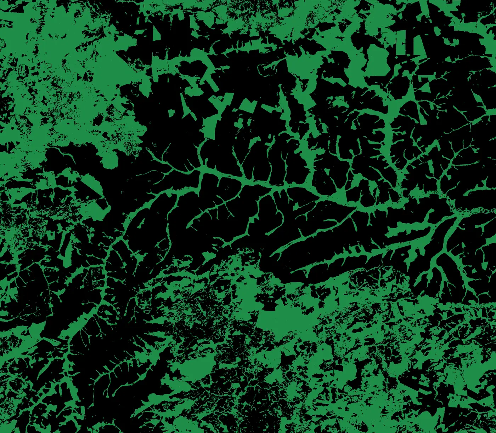
      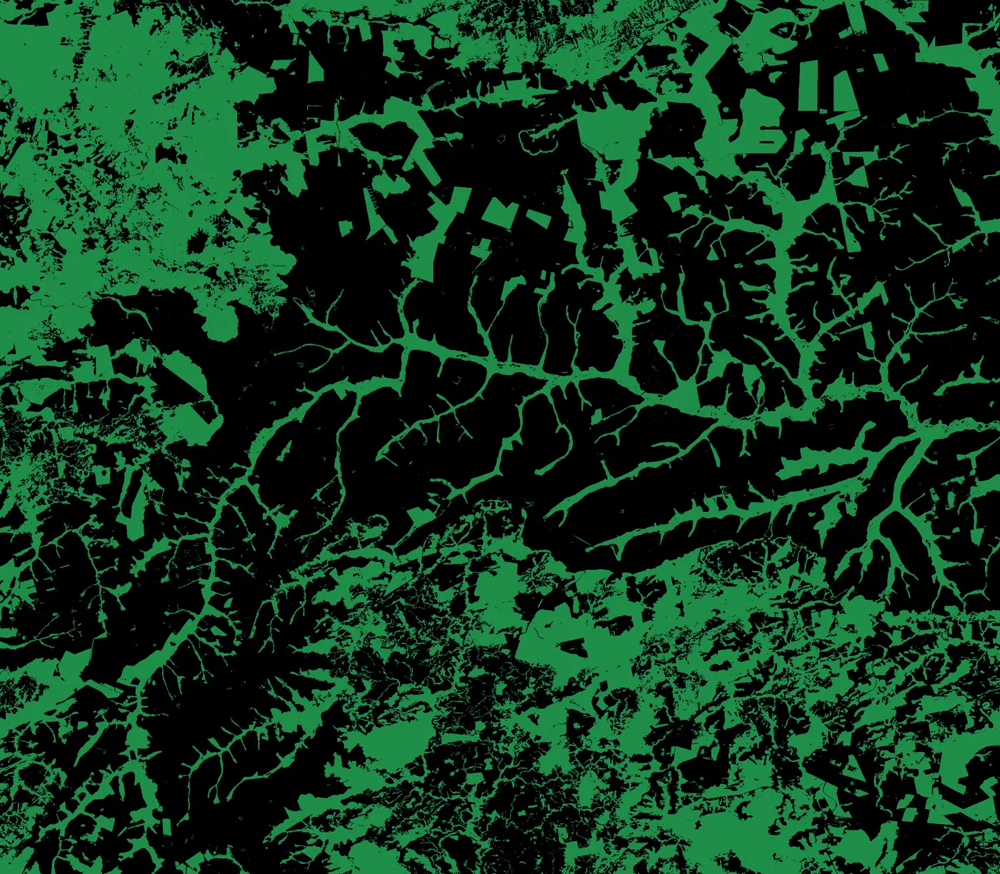
      <div class="compare-handle"></div>
      <input class="compare-range" type="range" min="0" max="100" value="50" aria-label="Comparar os dois trimestres">
      <span class="compare-label left">2020 Q1</span>
      <span class="compare-label right">2026 Q2</span>
    </div>
    <p class="compare-caption reveal">Predição do modelo na mesma cena, em 2020 Q1 e 2026 Q2. Arraste o divisor para comparar.</p>
  </div>

  <div class="rsec-block">
    <h3 class="rsec-sub reveal">Seis anos de floresta, trimestre por trimestre</h3>
    <p class="reveal">26 mapas trimestrais, de 2020 Q1 a 2026 Q2, percorridos por
    um controle deslizante.</p>

    <div class="scrub reveal" data-scrub data-base="images/floresta/trim-" data-ext=".webp" data-play-label="Percorrer os trimestres" data-pause-label="Pausar" data-quarters="2020q1,2020q2,2020q3,2020q4,2021q1,2021q2,2021q3,2021q4,2022q1,2022q2,2022q3,2022q4,2023q1,2023q2,2023q3,2023q4,2024q1,2024q2,2024q3,2024q4,2025q1,2025q2,2025q3,2025q4,2026q1,2026q2">
      <div class="scrub-stage">
        
        <span class="scrub-badge">2026 Q2</span>
      </div>
      <div class="scrub-controls">
        <input class="scrub-range" type="range" min="0" max="25" step="1" value="25" aria-label="Trimestre do mapa">
        <span class="scrub-label">2026 Q2</span>
      </div>
    </div>
    <p class="explorer-caption reveal">Predição de floresta por trimestre. As imagens carregam sob demanda, um trimestre por vez.</p>
  </div>

  <div class="rsec-block">
    <h3 class="rsec-sub reveal">O que o modelo vê e com que confiança</h3>
    <div class="explorer reveal" data-explorer data-captions="Predição do modelo para o trimestre 2023 Q3, cobrindo a área completa de análise.|Predição restrita às áreas de Cadastro Ambiental Rural, onde o imóvel é a unidade de análise.|Referência de floresta de 2023, usada na avaliação do modelo.">
      <div class="explorer-stage">
        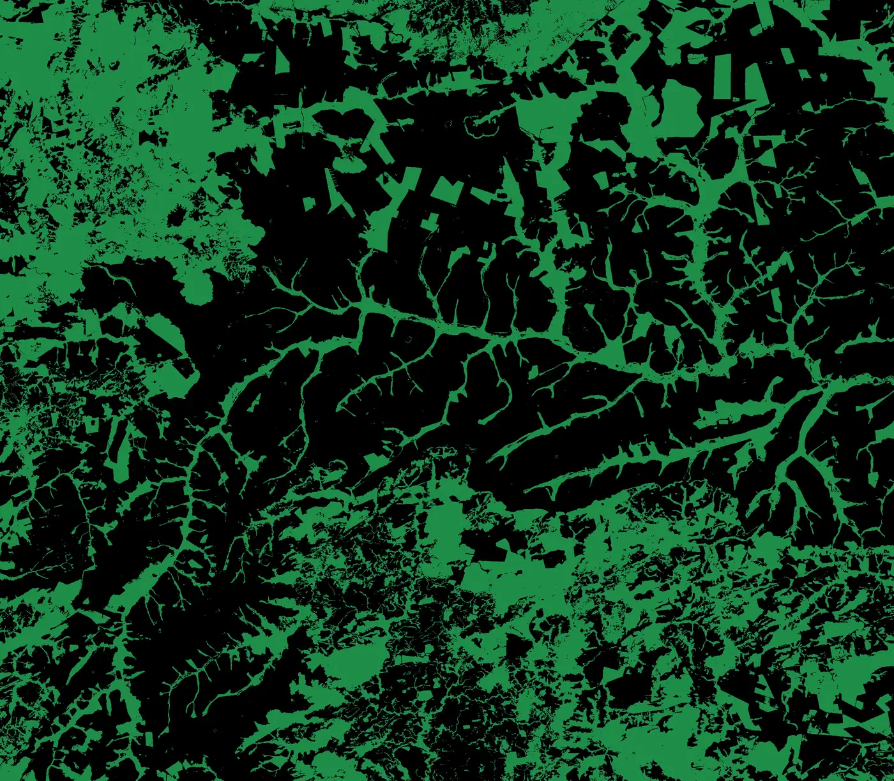
        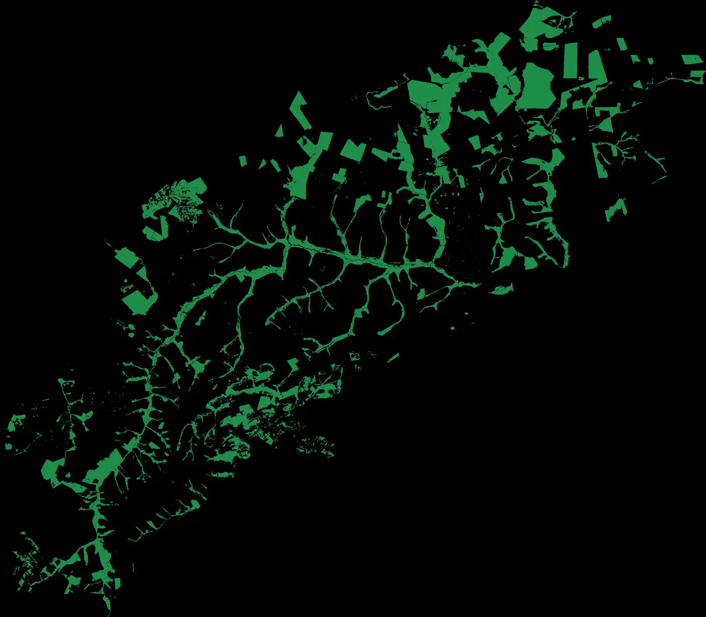
        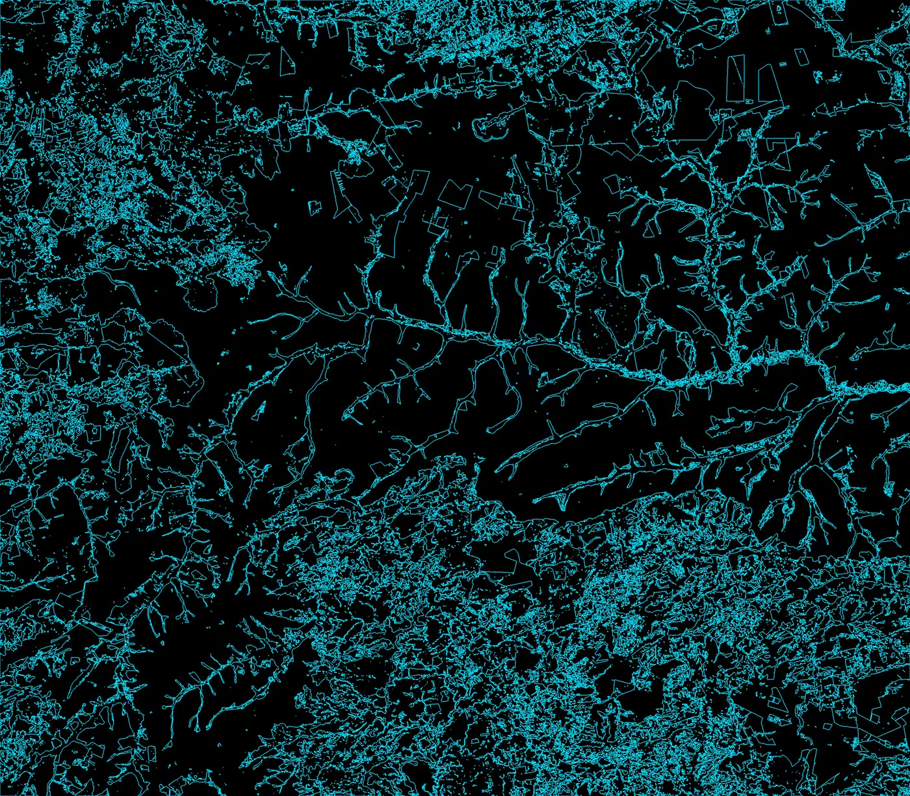
      </div>
      <div class="explorer-tabs" role="tablist" aria-label="Camadas do mapa de floresta">
        <button class="explorer-tab" type="button" role="tab" aria-selected="true">Predição do modelo</button>
        <button class="explorer-tab" type="button" role="tab" aria-selected="false">Áreas de CAR</button>
        <button class="explorer-tab" type="button" role="tab" aria-selected="false">Referência 2023</button>
      </div>
      <p class="explorer-caption">Predição do modelo para o trimestre 2023 Q3, cobrindo a área completa de análise.</p>
    </div>

    <figure class="fig-card reveal">
      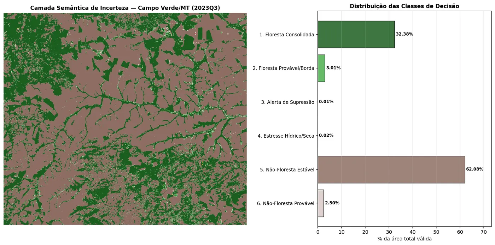
      <figcaption>Confiança do modelo pixel a pixel, em seis classes, no trimestre 2023 Q3. Cada cor indica o quanto a decisão daquele pixel é estável.</figcaption>
    </figure>

    <div class="nota reveal">
      <strong>Onde o modelo erra.</strong> Na validação contra os alertas DETER e os
      polígonos PRODES, o recall da classe de floresta fica em 0,28 e 0,26, e a área
      prevista é maior que a área alertada, 165,3 km² contra 27,1 km² do DETER e
      44,5 km² do PRODES. Parte disso é diferença de critério: o alerta oficial marca
      o corte recente, o modelo marca a ausência de dossel. Publicamos o número
      porque ele define o uso correto do produto.
    </div>
  </div>

  <div class="rsec-block">
    <h3 class="rsec-sub reveal">Resultados por trimestre e por célula</h3>
    <div class="fig-grid reveal">
      <figure class="fig-card">
        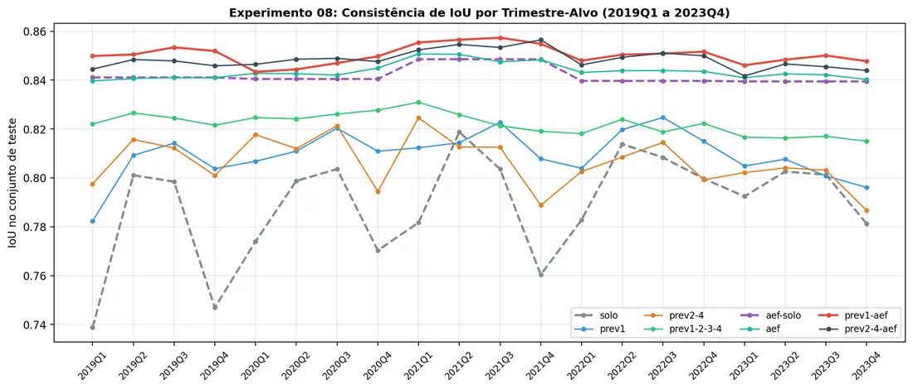
        <figcaption>Desempenho por trimestre no experimento de contexto temporal, que usa o trimestre anterior como informação adicional.</figcaption>
      </figure>
      <figure class="fig-card">
        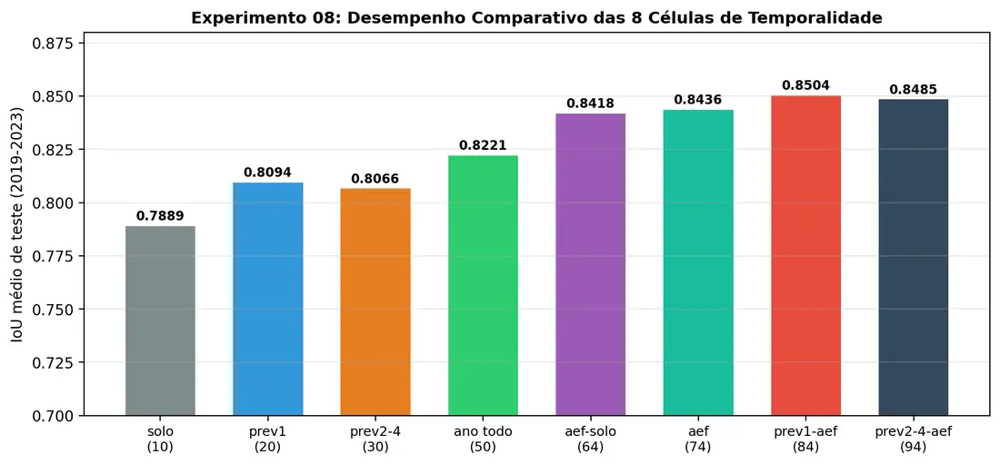
        <figcaption>Desempenho por célula do recorte, mostrando onde o modelo é mais ou menos estável dentro da mesma área.</figcaption>
      </figure>
      <figure class="fig-card">
        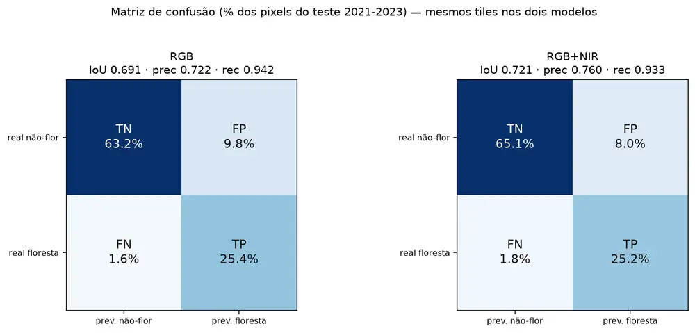
        <figcaption>Matriz de confusão do modelo trimestral. A banda infravermelha próxima leva o IoU de 0,72 para 0,74.</figcaption>
      </figure>
      <figure class="fig-card">
        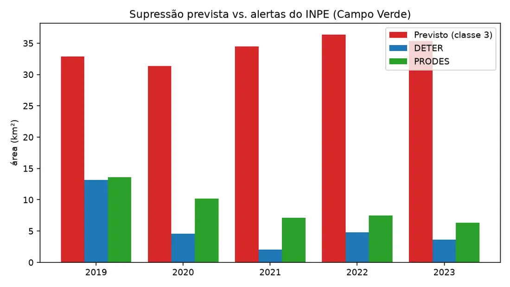
        <figcaption>Área por ano segundo o modelo e segundo os dois sistemas oficiais, DETER e PRODES.</figcaption>
      </figure>
    </div>
  </div>

  <div class="metrics reveal">
    <div><div class="m-val">0,85</div><div class="m-lab">IoU no melhor modelo</div></div>
    <div><div class="m-val">26</div><div class="m-lab">Trimestres mapeados</div></div>
    <div><div class="m-val">180</div><div class="m-lab">GeoTIFF entregues</div></div>
    <div><div class="m-val">203</div><div class="m-lab">Alertas DETER avaliados</div></div>
  </div>

  <div class="hscroll-wrap reveal">
    <button class="hscroll-btn prev" aria-label="Projetos anteriores"><svg viewBox="0 0 24 24" fill="none" stroke="currentColor" stroke-width="2.5" stroke-linecap="round"><path d="M15 5l-7 7 7 7"/></svg></button>
    <div class="hscroll">
      <article class="hs-card"><div class="hs-kicker">Projeto 01</div><div class="hs-title">Segmentação de floresta por satélite</div><div class="hs-text">Modelo SegFormer com imagens Sentinel-2 do Brazil Data Cube: 0,74 de IoU na versão trimestral com a banda infravermelha e 0,85 com contexto temporal. A grade de análise tem 9.712 por 11.110 pixels, em cerca de 10 metros por pixel.</div></article>
      <article class="hs-card"><div class="hs-kicker">Projeto 02</div><div class="hs-title">Generalização espacial</div><div class="hs-text">Treino em uma região e teste em outra, para medir o que o modelo aprende de floresta e o que aprende de lugar: 0,79 de oeste para leste e 0,76 de sul para norte.</div></article>
      <article class="hs-card"><div class="hs-kicker">Projeto 03</div><div class="hs-title">Floresta dentro das áreas de CAR</div><div class="hs-text">Avaliação com o imóvel rural como unidade: 0,797 de IoU. A floresta ocupa 24 % da área de CAR, contra 37 % do retângulo que envolve a cena.</div></article>
      <article class="hs-card"><div class="hs-kicker">Projeto 04</div><div class="hs-title">Validação contra DETER e PRODES</div><div class="hs-text">203 alertas do DETER e 9.105 polígonos do PRODES comparados com a predição, com os limites publicados junto com o resultado.</div></article>
      <article class="hs-card"><div class="hs-kicker">Projeto 05</div><div class="hs-title">Entregas trimestrais</div><div class="hs-text">180 arquivos GeoTIFF entregues, um por trimestre e por recorte, de 2020 a 2026, prontos para uso em sistema de informação geográfica.</div></article>
    </div>
    <button class="hscroll-btn next" aria-label="Próximos projetos"><svg viewBox="0 0 24 24" fill="none" stroke="currentColor" stroke-width="2.5" stroke-linecap="round"><path d="m9 5 7 7-7 7"/></svg></button>
  </div>
</section>

<section id="clima" class="rsec">
  <div class="rsec-head reveal">
    <div class="rsec-num">03</div>
    <div>
      <span class="rsec-kicker">Frente de pesquisa</span>
      <h2>Clima</h2>
    </div>
  </div>
  <p class="rsec-lead reveal">Tendências climáticas e risco agrícola em janelas de
  15 anos, município por município, ligando a série do clima ao comportamento da
  lavoura.</p>

  <div class="rsec-block">
    <h3 class="rsec-sub reveal">15 anos de clima em Nova Mutum, Mato Grosso</h3>
    <p class="reveal">Seis indicadores de tendência entre 2011 e 2025, comparados com
    a média de 1985 a 2010 quando existe série de referência.</p>

    <div class="trend-grid reveal">
      <div class="trend-card">
        <div class="trend-name">Temperatura máxima</div>
        <div class="trend-value" data-count="1.1" data-decimals="1" data-prefix="+" data-suffix=" °C">0</div>
        <div class="trend-note">aumento em 15 anos, cerca de 0,076 °C por ano</div>
      </div>
      <div class="trend-card">
        <div class="trend-name">Temperatura média</div>
        <div class="trend-value" data-count="0.9" data-decimals="1" data-prefix="+" data-suffix=" °C">0</div>
        <div class="trend-note">aumento em 15 anos, cerca de 0,066 °C por ano</div>
      </div>
      <div class="trend-card">
        <div class="trend-name">Temperatura mínima</div>
        <div class="trend-value" data-count="0.8" data-decimals="1" data-prefix="+" data-suffix=" °C">0</div>
        <div class="trend-note">aumento em 15 anos, cerca de 0,056 °C por ano</div>
      </div>
      <div class="trend-card">
        <div class="trend-name">Noites quentes</div>
        <div class="trend-value" data-count="108" data-prefix="+" data-suffix=" dias">0</div>
        <div class="trend-note">noites com mínima acima de 22 °C, 7,7 dias a mais por ano</div>
      </div>
      <div class="trend-card">
        <div class="trend-name">Chuva acumulada no ano</div>
        <div class="trend-value">1.631 mm</div>
        <div class="trend-note">média do período, 7,7 % abaixo dos 1.767 mm de 1985 a 2010</div>
      </div>
      <div class="trend-card">
        <div class="trend-name">Dias secos na estação chuvosa</div>
        <div class="trend-value">24,5 dias</div>
        <div class="trend-note">média do período, 5,3 dias a mais que os 19,2 dias de 1985 a 2010</div>
      </div>
    </div>
  </div>

  <div class="rsec-block">
    <h3 class="rsec-sub reveal">Risco operacional e risco sistêmico</h3>
    <p class="reveal">A leitura é sempre em relação à vizinhança, para separar o que
    é problema da fazenda do que é problema da região.</p>

    <div class="risco-pair reveal">
      <div class="risco-card">
        <div class="risco-kicker">Risco operacional</div>
        <h4>Manejo, praga, condição e contexto do produtor</h4>
        <p>O que diferencia um talhão dos vizinhos próximos, com o mesmo clima e o mesmo solo.</p>
      </div>
      <div class="risco-card">
        <div class="risco-kicker">Risco sistêmico</div>
        <h4>Seca, geada e veranico regional</h4>
        <p>O que atinge a região inteira, e por isso não se resolve com decisão de manejo isolada.</p>
      </div>
    </div>
  </div>

  <div class="metrics reveal">
    <div><div class="m-val">15</div><div class="m-lab">Anos de série</div></div>
    <div><div class="m-val">6</div><div class="m-lab">Indicadores de tendência</div></div>
    <div><div class="m-val">+108</div><div class="m-lab">Noites quentes</div></div>
    <div><div class="m-val">2011 a 2025</div><div class="m-lab">Período analisado</div></div>
  </div>

  <div class="hscroll-wrap reveal">
    <button class="hscroll-btn prev" aria-label="Projetos anteriores"><svg viewBox="0 0 24 24" fill="none" stroke="currentColor" stroke-width="2.5" stroke-linecap="round"><path d="M15 5l-7 7 7 7"/></svg></button>
    <div class="hscroll">
      <article class="hs-card"><div class="hs-kicker">Projeto 01</div><div class="hs-title">Tendência climática municipal</div><div class="hs-text">Janelas de 15 anos com seis indicadores por município, para separar tendência de variação de ano a ano.</div></article>
      <article class="hs-card"><div class="hs-kicker">Projeto 02</div><div class="hs-title">Noites quentes e estresse térmico</div><div class="hs-text">A mínima acima de 22 °C acumulou 108 noites a mais em 15 anos. É o indicador que mais conversa com perda de produtividade.</div></article>
      <article class="hs-card"><div class="hs-kicker">Projeto 03</div><div class="hs-title">Chuva e veranico</div><div class="hs-text">Chuva acumulada e dias secos na estação chuvosa, comparados com a referência de 1985 a 2010.</div></article>
      <article class="hs-card"><div class="hs-kicker">Projeto 04</div><div class="hs-title">Índices de vegetação como sensor de seca</div><div class="hs-text">A resposta da lavoura à falta de água aparece na série de índices antes de aparecer na produtividade, o que liga esta frente à de Agricultura.</div></article>
    </div>
    <button class="hscroll-btn next" aria-label="Próximos projetos"><svg viewBox="0 0 24 24" fill="none" stroke="currentColor" stroke-width="2.5" stroke-linecap="round"><path d="m9 5 7 7-7 7"/></svg></button>
  </div>
</section>
</div>
<aside class="side-toc" data-spy aria-label="Sumário">
<div class="side-toc-body">
  <div class="side-toc-title">Sumário</div>
  <ul>
    <li><a class="side-toc-link" href="#agricultura">Agricultura</a></li>
    <li><a class="side-toc-link" href="#floresta">Floresta</a></li>
    <li><a class="side-toc-link" href="#clima">Clima</a></li>
  </ul>
</div>
</aside>
</div>
```
